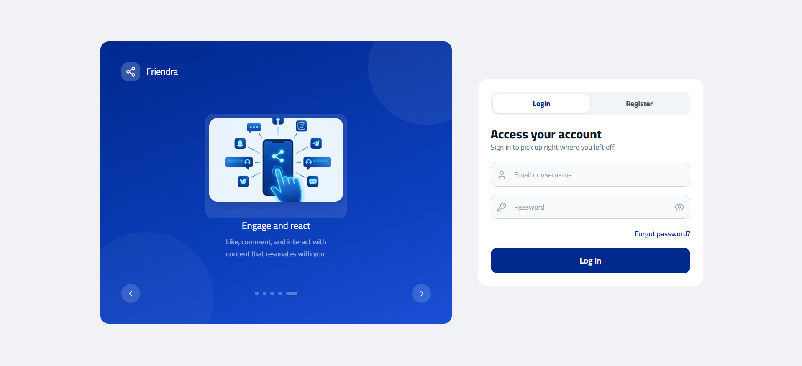
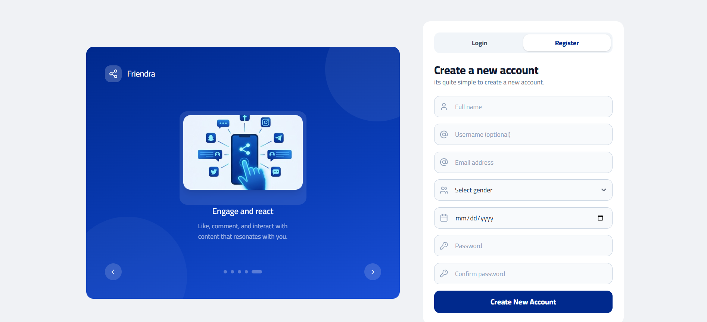
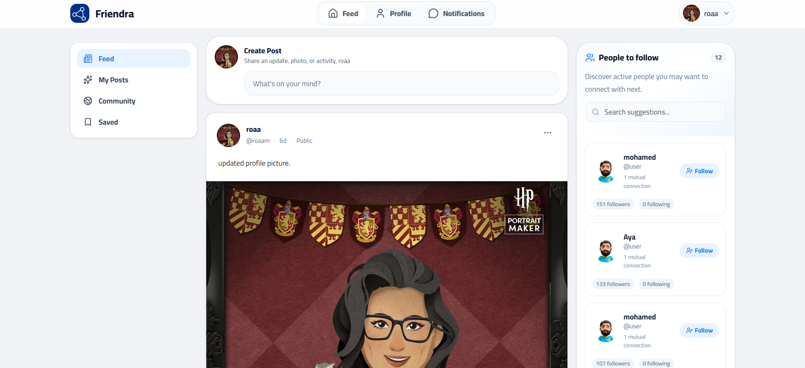
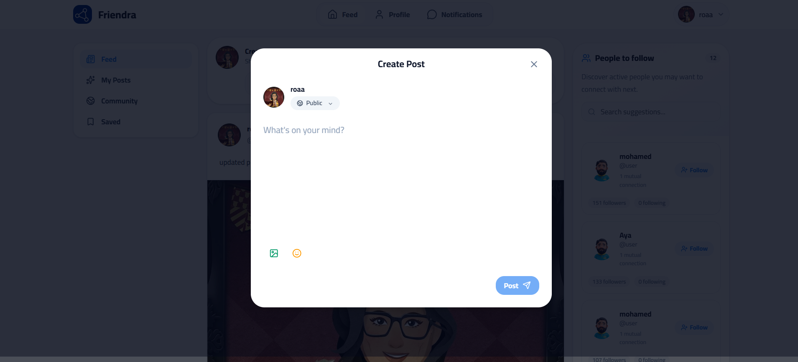
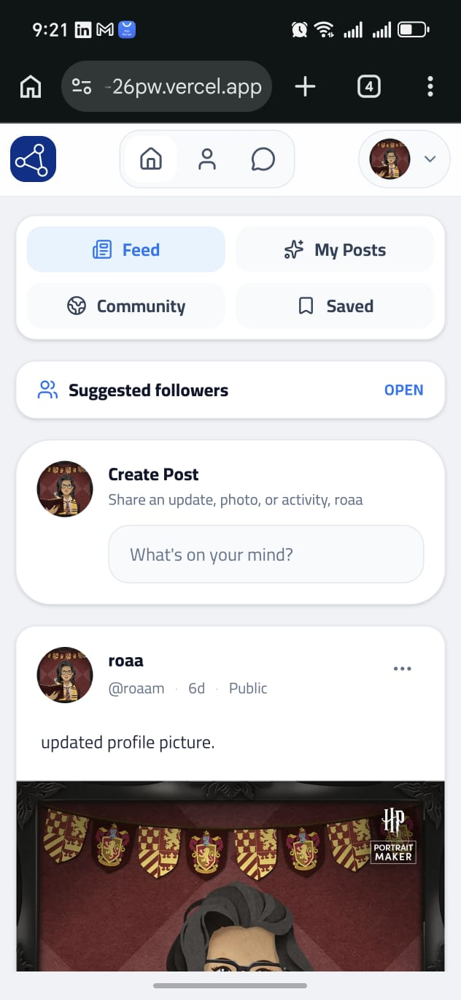
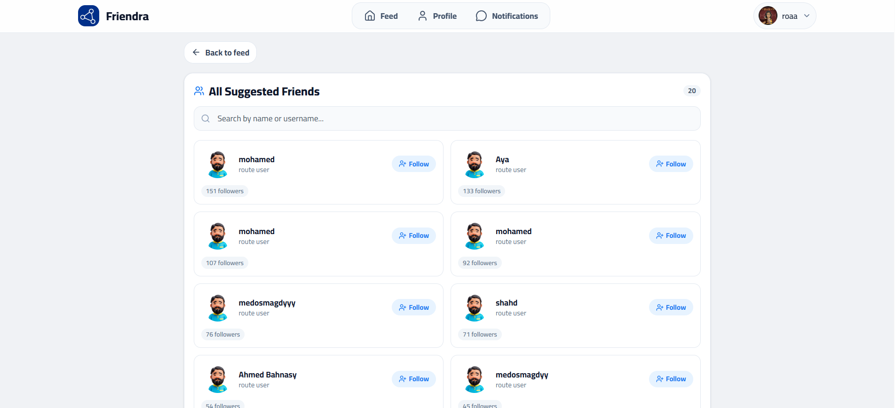
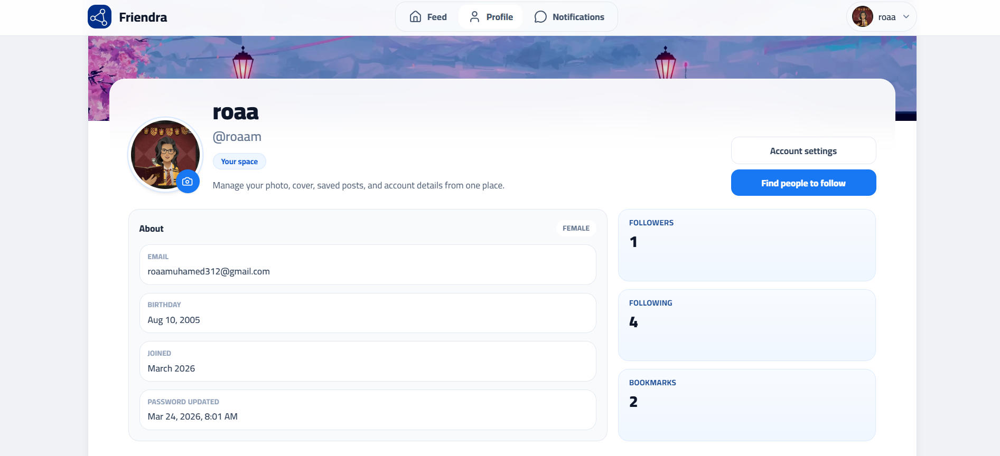
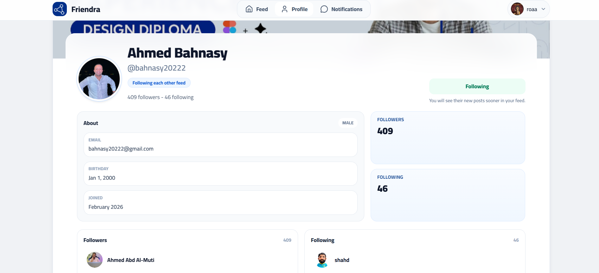
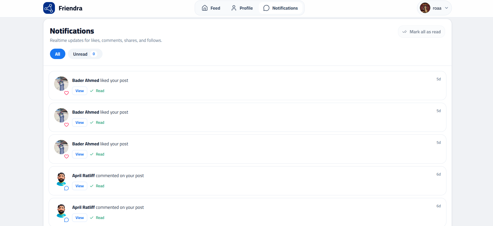
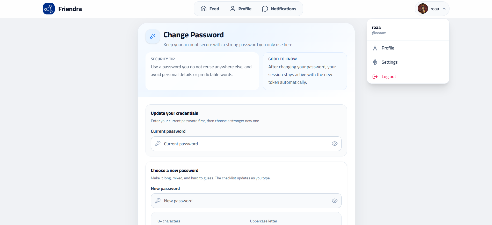

# Friendra

A modern social platform built with Angular 20, focused on clean UI, modular frontend architecture, and polished user interactions across feed, profile, notifications, and account management flows.

## Live Demo

[View the live app](https://angular-social-platform-26pw.vercel.app)

## Features

- User authentication with login and registration flows
- Protected and guest-only routing with auth guards
- Personalized home feed with multiple sections such as feed, my posts, community, and saved posts
- Create, edit, delete, like, bookmark, comment on, and share posts
- Shared post rendering with embedded original post previews
- Comment threads with replies, pagination, and inline actions
- Suggestions page with follow actions and search
- Profile pages for the current user and other users
- Profile photo and cover viewing, upload handling, and account-focused profile actions
- Notifications inbox with unread filters, mark-as-read actions, and synced unread counts
- Change password flow with validation and updated session token handling
- Responsive layout with mobile-friendly feed navigation and sidebar behavior

## Tech Stack

- Angular 20
- TypeScript
- RxJS
- Tailwind CSS 4
- ngx-spinner
- ngx-toastr
- SweetAlert2
- Flowbite
- Font Awesome
- Vercel for deployment

## Project Structure

```text
src/
  app/
    core/
      guards/
      interceptors/
      models/
      services/
    features/
      auth/
      change-password/
      feed/
      notifications/
      post-details/
      profile/
      suggestions/
    layouts/
      auth-layout/
      main-layout/
    shared/
      components/
      directives/
      pipes/
      validators/
```

## Architecture Highlights

- `core` contains application-wide building blocks such as guards, interceptors, API models, and domain services.
- `features` groups screens by business domain to keep flows easier to evolve independently.
- `shared` contains reusable UI and behavior primitives, including the navbar, avatar pipe, validators, and reusable directives.
- Standalone components are used throughout the app.
- HTTP concerns are centralized through dedicated interceptors for auth, loading, and error handling.
- Post rendering and merge behavior are normalized through shared post services rather than being scattered across templates.

## Key Frontend Patterns

- Standalone Angular components and route composition
- Service-based API access with typed response interfaces
- Centralized request handling with interceptors
- Shared UI behaviors through directives and pipes
- Cached current-user hydration to improve perceived loading
- Toast-first feedback for routine actions, with modal alerts reserved for more important cases

## Screenshots

Add your screenshots under a folder such as `docs/screenshots/` and keep the names below for the README to work cleanly.

### Authentication


*Login screen with a split auth layout and guided sign-in flow.*


*Registration flow with validation, guided inputs, and onboarding visuals.*

### Feed


*Desktop feed view with post composer, sidebar navigation, and suggestions.*


*Create post modal with privacy selection and media support.*


*Mobile feed layout optimized for smaller screens.*

### Discovery and Profiles


*Suggestions page with search, follow actions, and follower counts.*


*Current-user profile with account actions, stats, and profile management.*


*Public profile view with follow state and user details.*

### Account and Activity


*Notifications inbox with filters, read states, and action shortcuts.*


*Account security page with password validation and settings access.*

## Installation and Setup

### 1. Clone the repository

```bash
git clone https://github.com/RouaMohammed-SE/angular-social-platform.git
cd angular-social-platform
```

### 2. Install dependencies

```bash
npm install
```

### 3. Run the development server

```bash
npm start
```

Then open `http://localhost:4200`.

## Available Scripts

```bash
npm start
npm run build
npm test
```

## Build and Deployment

### Production build

```bash
npm run build
```

The app uses Angular production builds and is configured for deployment on Vercel.

### Vercel

This project is deployed on Vercel:

- Live URL: https://angular-social-platform-26pw.vercel.app
- Typical deployment flow:
  - push code to GitHub
  - connect the repository to Vercel
  - deploy from the `main` branch

If you are deploying manually, make sure your dependency versions stay aligned with Angular 20.

## Code Architecture

### Interceptors

- `auth-interceptor` attaches the stored token to outgoing requests
- `loading-interceptor` manages the global loading spinner
- `errors-interceptor` centralizes API error handling and user feedback
- request context helpers are used to opt specific requests out of global loading or error behavior when needed

### Services

- `AuthService` handles authentication, token storage, and password changes
- `UserService` manages current-user profile data, suggestions, follow actions, and profile updates
- `PostsService` handles post CRUD, likes, bookmarks, and sharing
- `CommentsService` handles comments, replies, and related interactions
- `NotificationsService` manages notifications and unread count syncing
- `PostEntityService` normalizes and merges post data for more stable UI rendering

## Future Improvements

- Lazy load route-level screens to reduce the initial bundle size
- Further extract shared thread/comment state to reduce duplication between feed and post details
- Expand profile editing beyond password and media updates
- Add richer notification actions and deeper linking behavior
- Improve automated test coverage for feature flows and interaction-heavy components
- Add dedicated screenshot assets and documentation visuals

## Author

**Roaa Mohamed**

- GitHub: [RouaMohammed-SE](https://github.com/RouaMohammed-SE)
- LinkedIn: [linkedin.com/in/rouamohammed](https://www.linkedin.com/in/rouamohammed/)

